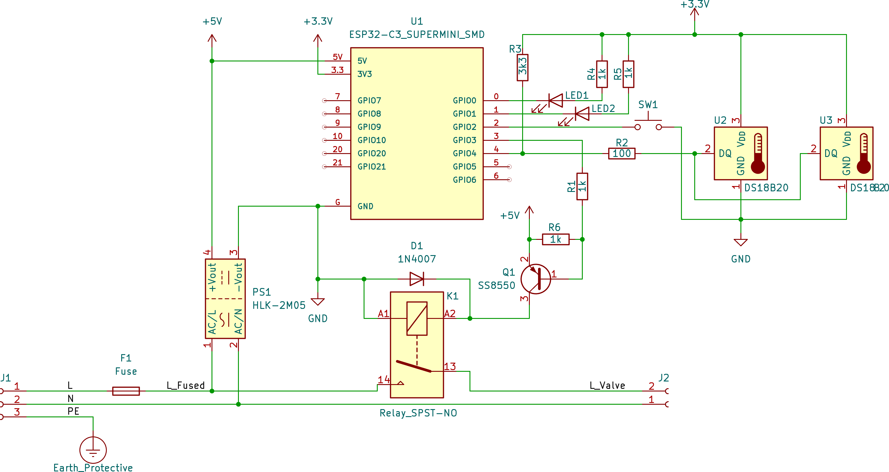
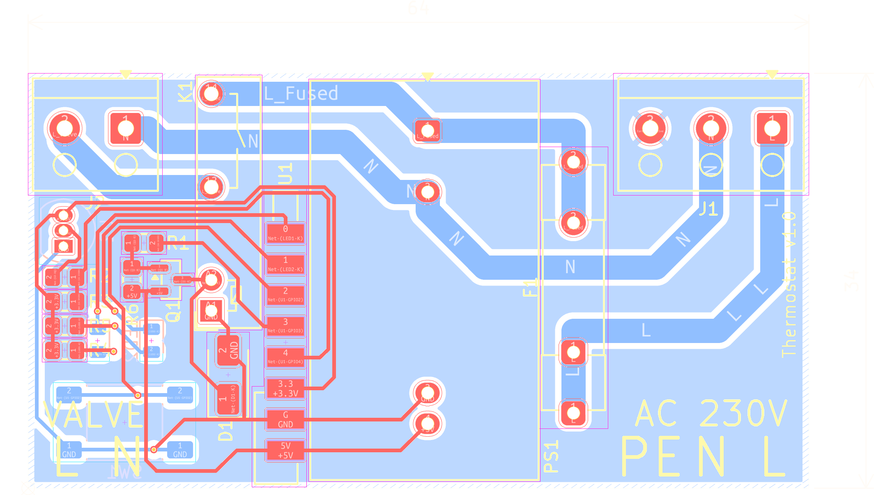

# Radiátor Ranger

## 🥶➡️🔥 Chytrý termostat pro radiátorové hlavice (ESPHome)

**Radiátor Ranger** je chytrý regulátor pro radiátorové vytápění založený na ESP32-C3 a ESPHome.  
Je navržený pro termoelektrické hlavice typu **NO – normally open**, je spolehlivý, fail-safe a plně integrovatelný s Home Assistantem.

Zařízení vzniklo jako druhá generace původního domácího prototypu – tentokrát už s profesionální DPS, plnou diagnostikou a 3D tištěnou krabičkou.

---

## ✨ Hlavní vlastnosti

- Síťové napájení (bez baterií)  
- Fail-safe chování → při výpadku je radiátor *vždy plně otevřen*  
- Externí teplota z Home Assistanta  
- Automatický fallback na interní senzor  
- Detekce otevřeného okna (libovolný binární senzor z HA)  
- Ochrana proti zamrznutí  
- Režim topné sezóny  
- Boost (časovaný i trvalý), ovládaný tlačítkem  
- LED indikace stavu a chyb  
- 4 teplotní předvolby: Away, Sleep, Home, Comfort  
- Stavový výstup pro nadřazený systém (zda je potřeba topit)  
- Interní teplota radiátoru pro diagnostiku  

---

## 🧠 Jak to funguje

### Teplota  
- Primární teplotu poskytuje externí senzor z HA.  
- Při výpadku → automatický přechod na interní čidlo DS18B20.

### Otevřené okno  
- Otevření → zpoždění 2 minuty  
- Zavření → zpoždění 10 sekund  
- Při poklesu pod bezpečnou teplotu (např. 5 °C) se radiátor otevře kvůli nezámrzu.

### Topná sezóna  
- Mimo sezónu se ventil nezavírá → šetří se aktuátor i ventil.

### Stavová hlášení  
Termostat poskytuje stavy:  
*Vypnuto, Protizámrzný režim, Zapnuto, Topí, Větrání, Boost, Není topná sezóna.*

---

## 🧩 Ovládací prvky

### Tlačítko  
- krátký stisk → boost na 2 h  
- dvojstisk → trvalý boost  
- krátký stisk během boostu → vypnutí  
- dlouhý stisk → vypnutí / zapnutí termostatu

### LED  
- **zelená** – boost (blikání / trvale)  
- **červená** – chyby  
  - blikání = výpadek externího čidla  
  - trvale = výpadek interního čidla

---

## 🛠 Hardware Overview

### Schéma zapojení


---

### Návrh DPS


---

### 3D náhled elektroniky


---

### 3D tištěná krabička


---

## 🧑‍💻 Software – ESPHome

Zařízení používá ESPHome s komponentou `climate` a vlastní sadou automatizací.

### Vybrané hodnoty konfigurace

```yaml
substitutions:
  device_internal_name: "radiator-v-predsini"
  device_suffix: "_v_predsini"
  device_friendly_name: "Radiátor v předsíni"

  device_sampling_time: "10s"

  led_green_brightness: "0.4"
  led_red_brightness: "0.6"

  dallas_diag: "0xab000000836f6328"
  dallas_fallback: "0xd500000083450828"

  external_temp_sensor: "sensor.teplomer${device_suffix}_temperature"
  heating_season_entity: "input_boolean.topna_sezona"
  open_window_entity: "input_boolean.dummy_zavreneho_okna"

  preset_temp_away: "10"
  preset_temp_sleep: "10"
  preset_temp_home: "15"
  preset_temp_comfort: "15"

  boost_minutes: "120"
  radiator_safe_temp: "5"
```

---

## 📦 Obsah repozitáře

```
/ESPHome      – ESPHome konfigurace  
/images        – obrázky pro README  
README.md      – tento soubor  
```

---

## 📝 Licence
MIT License © Jan Pruha
